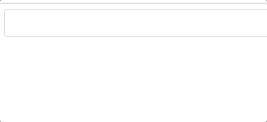

# React Autocorrect Input Component

autocorrect input react component



### Doc
https://reactmaker.github.io/react-autocorrect-input/

### requirement

- React 16.4^

### Download from NPM

```
npm install @reactmaker/react-autocorrect-input
```

### How to use

```javascript
import React from 'react';
import { render } from 'react-dom';
import { hot } from 'react-hot-loader';
import Input from '@reactmaker/react-autocorrect-input';

class Demo extends React.Component {
  state = {
    value: '',
    dataSource: ['apple', 'ask', 'applice', 'best', 'book', 'beep', 'cat', 'can', 'car'],
  }

  onChange = (value) => this.setState({ value })

  render() {
    const { value, dataSource } = this.state;
    return (
      <Input onChange={this.onChange} value={value} dataSource={dataSource} />
    );
  }
}

const Main = hot(module)(Demo);

render(<Main />, document.getElementById('app'));

```
